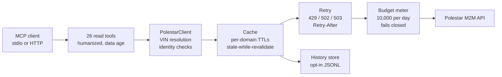

<div align="center">

# polestar-mcp

**Ask your Polestar questions in plain language. Get answers from what the car reports.**

A [Model Context Protocol](https://modelcontextprotocol.io) server for the [Polestar Data Portal M2M API](https://data-portal.polestar.com), built for any MCP client: Claude Desktop, ZCode, Cursor, or your own tooling.


</div>

Ask "how is my car doing?" and the assistant calls one tool, reads one cached answer, and tells you the charge level, the range, whether everything is locked, and how old each number is. Ask "when will it be charged?" or "plan the cheapest charging for tonight" and it estimates or plans from the car's own configuration.

Every answer is a read. Polestar's documented v1 API publishes no write endpoints, so there is nothing here that can lock your car, start the climate, or change a charge limit. Every tool carries the MCP `readOnlyHint`, so clients can auto-approve it.

> [!IMPORTANT]
> Setup has exactly one trap: the Data Portal gives you two identifiers and the API needs both. The OAuth **client ID** authenticates the token request; the **Account ID** (labeled `x-client-id` on the portal page) identifies you on every vehicle request. Sending the client ID as the Account ID fails every call with `403 AUTHZ_CLIENT_ID_MISMATCH`. The server checks for this at startup and warns you.

## What you can ask

| You ask | The assistant calls | You get |
| --- | --- | --- |
| "How is my car doing?" | `get_car_status` | One briefing: charge, range, locks, availability, odometer, service countdown, data ages |
| "Is everything locked?" | `is_car_secure` | A yes/no verdict that names anything open |
| "Does anything need attention?" | `get_needs_attention` | Active warnings only, plus the service countdown |
| "When will it be charged?" | `get_charging_estimate` | Energy and time to target, with every assumption stated |
| "Plan the cheapest charging tonight" | `plan_cheapest_charge` | A schedule of hours, given a spot-price curve you paste in |
| "Where is the car?" | `get_location` | Last known position with heading, speed, and data age |
| "How has the battery aged?" | `get_degradation_report` | Capacity and range trends (needs history, see below) |

Domain tools answer in short prose with the data age in the header, and `raw: true` appends the untouched API payload:

```text
Vehicle My Car: telemetry/battery (data observed 12 min ago)
Charge: 52% · range 170 km
Charging: Idle · Unplugged
Average consumption: 20.1 kWh/100km
```

(Vehicle name and values come from the project's sanitized test fixtures; live answers carry your own labels and numbers.)

## Quickstart

### 1. Try it offline, no Polestar credential

The repository ships a sanitized captured dump, and the demo asserts real values through the full server, token flow included:

```sh
npm install
npm run build
npm run demo-dump                       # runs the whole server in fixture mode, prints DUMP_OK
POLESTAR_FIXTURES_DIR=.. npm start      # serve the sibling captured dump interactively
```

Fixture mode needs a directory of captured responses laid out like `test/fixtures/dump`; the dump this project was built against sits one level up in the workspace. A dump without a token response fails with `AuthError: Token request failed (HTTP 404)`: fixture mode runs the real auth lifecycle rather than skipping it. A route with no fixture answers `NOT_FOUND`, deliberately distinct from `DATA_NOT_AVAILABLE`, so a missing fixture can never masquerade as "the car reports nothing".

### 2. Connect your car

1. Log in at [data-portal.polestar.com](https://data-portal.polestar.com), open the **Data Portal API** tab, and create a credential. Note the **client ID**, the **client secret** (shown once), and the **Account ID** (`x-client-id`) at the top of the page.
2. Store them outside any repository, in the server's home config:

   ```sh
   mkdir -p ~/.config/polestar-mcp
   cat > ~/.config/polestar-mcp/.env.secrets <<'EOF'
   POLESTAR_CLIENT_ID=paste-your-client-id-here
   POLESTAR_CLIENT_SECRET=paste-your-client-secret-here
   POLESTAR_ACCOUNT_ID=paste-your-account-id-here
   EOF
   ```

3. Point your MCP client at the built server:

   ```json
   {
     "mcpServers": {
       "polestar": {
         "command": "node",
         "args": ["/absolute/path/to/polestar-mcp/build/server.js"]
       }
     }
   }
   ```

4. Restart the client and ask something.

Credentials can also ride in the client's `env` block instead of the secrets file; real environment variables always win. The dotenv loader handles `export` prefixes, both quote styles, and trailing comments.

## The tools

Naming is mechanical: API domain `target-soc` becomes tool `get_target_soc`. Every tool that reads a car takes an optional `vin`; omit it on a single-vehicle credential and that car is used, and with several cars the tool asks which one (MCP elicitation) and validates the answer before sending it. Third-party credentials may pass a `delegated_account_id` argument, checked against the operator's allowlist because the API silently accepts unknown delegated IDs.

| Tool | What it answers |
| --- | --- |
| **Discovery** | |
| `list_vehicles` | VINs, or your friendly names, that this credential may access |
| `list_domains` | The server's own registry: every domain with endpoint, scope, and tool name |
| **Telemetry** | |
| `get_availability` | Whether the car is reachable/awake, and its usage mode |
| `get_battery` | Charge level, charging status and power, range, time to full, consumption, usable energy |
| `get_exterior` | Doors, windows, hood, tailgate, tank lid, central lock, tailgate lock, alarm |
| `get_health` | Service countdown (days, distance, engine hours) and fluid, light, and 12V warnings |
| `get_location` | Last known position, heading, speed, timestamp |
| `get_odometer` | Odometer and trip meters, average speeds |
| `get_parking_climatization` | Preheat/pre-cool status, runtime left, requested seat and wheel heating |
| `get_pre_cleaning` | Cabin air: PM2.5, air quality index, last pre-cleaning cycle |
| **Charging** | |
| `get_amp_limit` | Configured maximum AC charging current, source, last update |
| `get_charge_locations` | Saved charge locations |
| `get_charge_now` | Charge-now override state (override charge timer sync) |
| `get_global_charge_timer` | Recurring charge window: hours, timezone offset, activation, sync |
| `get_parking_climate_timer` | Scheduled climate timers: ready-at hour, weekdays, activation |
| `get_target_soc` | Target charge level and setting type |
| `get_is_at_charge_location` | Whether the car is at a saved charge location (often unreported) |
| **Aggregates and planning** | |
| `get_car_status` | One-call briefing: charge, range, locks, availability, odometer, service, ages |
| `is_car_secure` | Yes/no security verdict that names anything open |
| `get_needs_attention` | Active health warnings only, plus the service countdown |
| `get_charging_estimate` | Energy and time to reach the target SoC, assumptions stated |
| `plan_cheapest_charge` | Cheapest hours inside the car's charge window, given your spot prices |
| **System** | |
| `polestar_status` | Budget used and remaining with reset time, cache hit rate, token expiry, mode |
| **History** (opt-in) | |
| `get_history` | Recorded samples for one domain, one line per change |
| `get_degradation_report` | Implied full-charge range and capacity trend over history |
| `get_charging_sessions` | Charging sessions reconstructed from battery samples |

The fifteen `get_*` domain tools map one-to-one onto the API's fifteen read domains (eight telemetry, seven charging), each with its endpoint and OAuth scope embedded in the tool description. The full mapping, scopes, and worked examples are in [docs/tools-reference.md](docs/tools-reference.md).

## Resources, prompts, and subscriptions

- **Resources**: `polestar://vehicle/{vin}/{telemetry|charging}/{domain}`, listed from your credential's vehicles, with VIN and domain completions. Reading one returns the same humanized view as the matching tool.
- **Subscriptions**: subscribe to a resource and the server re-reads it once a minute through the cache, notifying the client only when the cloud's `metaEventId` changed, which happens only when the car reported something new. Subscriptions pause rather than spend the last 10% of the daily budget. (stdio only.)
- **Prompts**: three ready-made conversations, `car-status`, `charge-plan`, and `battery-health-report`, that wire common questions to the right tool sequence.
- **Annotations**: every read carries `readOnlyHint: true`; nothing mutates, so clients can skip confirmation prompts.

## How the 10,000-calls-per-day budget is handled

Polestar's M2M credential allows 10,000 calls per client per day, roughly seven per minute sustained. The server treats that as the resource it is:



- **Cache first.** Each URL gets a TTL matched to how fast the value can change: battery, location, and exterior 30 seconds; availability, odometer, and parking climatization 60 seconds; charging settings 5 minutes; health 10 minutes; pre-cleaning 30 minutes; the vehicle list 1 hour. An expired entry serves the last known value immediately (marked stale) while a single-flight refresh runs in the background, so latency never waits on Polestar.
- **Retry with limits.** 429 responses (honoring `Retry-After` when present) and 502/503 gateway errors are retried up to three times with capped backoff. Every attempt, retries included, is metered before it goes out.
- **Fail closed.** When the day's budget is spent, the server refuses further calls with the reset time in the error instead of spending calls it does not have. `polestar_status` shows exactly where you stand, and the resource poller and history sampler stand down on their own (at 90% and 80% spent respectively) so background features never eat the quota you need for real questions.
- **Tokens are managed.** One token request covers the union of all domain scopes (trim it with `POLESTAR_SCOPES` for least privilege), tokens are cached until expiry minus a 5-minute skew, concurrent callers share one request, and a 401 triggers exactly one fresh-token retry.

## History, sampling, and privacy

The API answers only "what is true right now", so longitudinal questions need a local memory. Set `POLESTAR_HISTORY_DIR` and every live domain answer lands in an append-only JSONL store, deduplicated by the cloud's `metaEventId` (unchanged snapshots cost a single line). That feeds `get_history`, `get_degradation_report` (implied full-charge range and capacity trends, presented as estimates rather than verdicts), and `get_charging_sessions` (start, duration, peak power, max SoC). Recording is passive: it reuses answers the server already fetched. If you also want the car sampled while nobody is asking, set `POLESTAR_SAMPLE=1`; the background round covers battery, odometer, location, and exterior every 10 minutes by default and stands down at 80% of the budget.

Three dials control what leaves your car and how it is named:

| Variable | Effect |
| --- | --- |
| `POLESTAR_VEHICLE_LABELS` | `VIN=Friendly Name` pairs, so answers say "My Car" instead of printing identifiers |
| `POLESTAR_REDACT_VIN=1` | Masks VINs in rendered output (first 3 and last 3 characters). Not with `raw:true`, which returns the payload as sent |
| `POLESTAR_ALLOW_LOCATION=0` | `get_location` refuses, and coordinates are stripped from aggregates |

## HTTP mode

Set `POLESTAR_HTTP_PORT=8420 npm start` and the same engine serves tools, resources, and prompts over stateless Streamable HTTP: each request is independent, while cache, budget, and history are shared. It binds `127.0.0.1` by default; binding any other address requires `POLESTAR_HTTP_TOKEN`, because a server that reads vehicle location must not sit unauthenticated on a shared network. Subscriptions remain a stdio feature.

<details>
<summary><strong>Full configuration reference (27 variables)</strong></summary>

The server knows exactly which variables it reads and warns about unrecognized ones (suggesting the closest real name); with `POLESTAR_STRICT_ENV=1` a typo is fatal instead of a warning. A value that is present but unusable, a bad URL, a non-numeric timeout, an out-of-range port, fails fast with the fix in the message.

| Variable | Default | Purpose |
| --- | --- | --- |
| `POLESTAR_CLIENT_ID` | required live | OAuth client ID from the Data Portal |
| `POLESTAR_CLIENT_SECRET` | required live | OAuth client secret |
| `POLESTAR_ACCOUNT_ID` | required live | The Account ID, sent as `x-client-id` (distinct from the client ID) |
| `POLESTAR_DELEGATED_ACCOUNT_ID` | unset | Default delegated account for third-party credentials |
| `POLESTAR_DELEGATED_ACCOUNT_IDS` | unset | Allowlist a call's `delegated_account_id` argument is checked against |
| `POLESTAR_BASE_URL` | production URL | Override the API base URL |
| `POLESTAR_M2M_TOKEN_ENDPOINT` | `{base}/token` | Override just the token endpoint |
| `POLESTAR_FIXTURES_DIR` | unset | Serve captured responses instead of the live API |
| `POLESTAR_ENV_FILE` | unset | Alternative dotenv path (default `~/.config/polestar-mcp/.env.secrets`) |
| `POLESTAR_TIMEOUT_MS` | 15000 | Hard deadline per HTTP request |
| `POLESTAR_BUDGET` | 10000 | Daily live-call ceiling; fails closed at the limit |
| `POLESTAR_BUDGET_PER_MINUTE` | 100 | Rolling per-minute ceiling the API also publishes; waited out rather than failed, when the wait fits the deadline |
| `POLESTAR_CACHE` | on | `off` disables the response cache |
| `POLESTAR_SCOPES` | all domain scopes | Space- or comma-separated scope override for the token request |
| `POLESTAR_HISTORY_DIR` | unset | Enable the JSONL history store (and history tools) here |
| `POLESTAR_HISTORY_SAMPLE_SECONDS` | 600 | Seconds between sampler rounds (clamped 60 to 3600) |
| `POLESTAR_SAMPLE` | off | `1` actually runs the background sampler; off by default, polling spends quota |
| `POLESTAR_VEHICLE_LABELS` | unset | `VIN=Name` pairs shown instead of VINs |
| `POLESTAR_REDACT_VIN` | off | `1` masks VINs in rendered output and the structured envelope. `raw:true` is exempt: it returns the upstream payload unchanged, VIN included |
| `POLESTAR_ALLOW_LOCATION` | on | `0` refuses location reads and strips coordinates |
| `POLESTAR_UNITS` | km | `mi` (or `miles`) for humanized distances |
| `POLESTAR_LOG` | normal | `debug` for verbose stderr diagnostics |
| `POLESTAR_ENABLE_WRITES` | off | Scaffold for future write endpoints; registers nothing today |
| `POLESTAR_HTTP_PORT` | 0 (stdio) | 1 to 65535 switches to Streamable HTTP |
| `POLESTAR_HTTP_HOST` | 127.0.0.1 | HTTP bind address |
| `POLESTAR_HTTP_TOKEN` | unset | Bearer token for HTTP mode; required off loopback |
| `POLESTAR_STRICT_ENV` | off | `1` makes an unrecognized variable fatal |

</details>

## Development

```sh
npm install
npm run build          # strict TypeScript, emits build/server.js
npm test               # unit suites: token lifecycle, client, runtime, planner, config registry
npm run smoke          # stdio end-to-end: registry, tools, resources, prompts, history
npm run smoke-http     # Streamable HTTP end-to-end over plain POSTs
npm run demo-dump      # stdio end-to-end against the real captured dump
npm run check-secrets  # secret-hygiene check
npm run typecheck      # types src, test, and scripts together
```

Requires Node 20 or newer. The suite covers what is easy to get subtly wrong: token single-flight and expiry skew, envelope unwrapping and identity checks, VIN resolution and delegation, cache TTLs and stale-while-revalidate, retry and budget metering, the charge-window planner (including windows that wrap midnight), history dedup and session reconstruction, and the configuration registry.

Verification is CI, not a claim in this file: every check runs on each push and pull request, and [CONTRIBUTING.md](CONTRIBUTING.md) carries the full table with what each one proves. The architecture is in [docs/architecture.md](docs/architecture.md) and [docs/development.md](docs/development.md); the domain words the code uses are defined in [CONTRIBUTING.md](CONTRIBUTING.md).

## Security

The threat model is in [SECURITY.md](SECURITY.md). Credentials live outside the repository (`~/.config/polestar-mcp/.env.secrets`, or `POLESTAR_ENV_FILE`), no `.env`-family file inside the tree is ever acceptable, and `npm run check-secrets` flags JWTs, opaque credential blobs, VIN-shaped identifiers including ones embedded in longer tokens, personal email, phone numbers and precise coordinates in every scanned file. Each detector proves itself on a positive control before a clean scan is allowed to count.

> [!WARNING]
> Captured dumps are credentials: they contain long-lived refresh tokens and location history. Do not commit them, paste them into issues, or share them casually.

Every API error carries the `requestId` and `timestamp` Polestar support can look up, preserved on the errors this server raises.

## Documentation

| Document | Contents |
| --- | --- |
| [Getting started](docs/getting-started.md) | Credentials, every variable explained, first calls, troubleshooting |
| [Tool reference](docs/tools-reference.md) | All 26 tools, endpoints and scopes, example responses |
| [Architecture](docs/architecture.md) | The client module, the cache/retry/budget chain, history, resources, HTTP mode |
| [The upstream API contract](docs/upstream-api.md) | Authentication, headers, envelope, errors, rate limits |
| [Live contract findings](docs/live-contract-findings.md) | What live probes settled about identity headers, VINs, domains, errors, and the token endpoint |
| [Development and verification](docs/development.md) | The test map, the CI checks, adding a tool |
| [Consumer API adapter note](docs/consumer-adapter-note.md) | Why the consumer app API stays unwired, and the shape when it lands |
| [Write endpoints](docs/write-endpoints.md) | The designed but dormant write surface and its safety rules |

## Status

The documented v1 API is read-only and this server is read-only with it: every tool carries `readOnlyHint`, and `POLESTAR_ENABLE_WRITES` registers nothing because Polestar publishes no v1 write endpoints. The app-side consumer API (car model details, render images) is deliberately not wired in either. Its GraphQL queries are unpublished and its refresh tokens rotate destructively, so wiring it would mean depending on a contract that can be revoked without notice.

This is a personal project for one owner's Polestar 2. It is not affiliated with or endorsed by Polestar.
